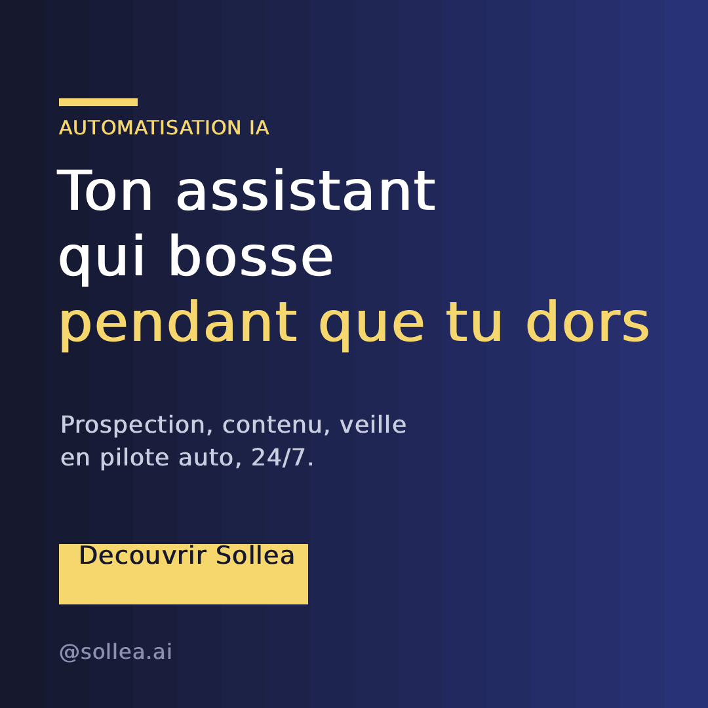

<h1 align="center">🎨 Photopea as Code</h1>

<p align="center">
  <b>Photoshop is $23/month. Photopea is free, runs in a browser — and you can script it.</b><br>
  Banners, social posts, mockups, batch edits. Real layers. One command. No Photoshop, no subscription, no API key.
</p>

<p align="center">
  
  
  
  
  
  
</p>

<p align="center">
  
</p>
<p align="center"><sub>👆 <i>This Instagram post was generated by <a href="scripts/make_square_post.py">one Python script</a> — gradient, accent bar, type ramp, CTA button, all in code. No mouse, no Photoshop.</i></sub></p>

**Claude Code:**

```
/plugin marketplace add mohamed-amine-ben-mallessa/photopea-as-code
/plugin install photopea-as-code
```

**Codex, Cursor, Copilot, Gemini CLI, or any of 50+ [Agent Skills](https://agentskills.io) hosts:**

```
npx skills add mohamed-amine-ben-mallessa/photopea-as-code -g
```

More options — plain Python, any MCP agent — in [Install](#install).

---

> **Text became the universal interface for software. Code is becoming it for design.**

## Why this exists

Designers automate with paid SaaS or brittle browser macros. Developers and AI agents need
something cleaner: **a free Photoshop you can drive from a script.**

Photopea can do it — it's a full Photoshop in the browser with a Photoshop-compatible JS
scripting model. But that scripting surface is scattered across 45 documentation pages and
nobody had centralized it. So this repo did: a tiny driver, ready-made recipes, an agent
skill, and **the only condensed, agent-oriented reference to the entire Photopea scripting API**.

| Image generators (DALL·E, etc.) | **Photopea as Code** |
|---|---|
| One-shot pixels you can't edit | **Real layers, text, shapes, masks** — editable |
| No precise control | **Pixel-exact** position, size, color, type |
| Can't do your brand template | **Open a PSD**, swap a smart object, export |
| Paid per image | **Free** — runs in the browser, no key |
| No batch | **Batch** mockups / variants / format conversion |

## 30 seconds to your first image

```bash
# Node is the only prerequisite (the Photopea MCP is fetched by npx on first run).
cd scripts
python make_square_post.py "DESIGN AS CODE" "Ship your visuals" "in one command." "Free. No Photoshop." "Get started" "@you" out.png
```

A browser window opens (that's Photopea — expected), the design is composed tool-by-tool,
and `out.png` lands on disk. Same for `make_banner.py`.

## Use it from your own code

```python
from photopea import Photopea, gradient_bg, text, rect, export

with Photopea() as pp:
    gradient_bg(pp, 1080, 1080, "#16182e", "#283276", angle=120)
    rect(pp, 90, 150, 120, 12, "#f5d76e")              # accent bar
    text(pp, "Hello", 88, 320, 96, "#ffffff", bold=True)
    export(pp, "out.png", "png")
```

Need something the helpers don't cover? Drop to raw Photopea JS:

```python
pp.run_script('app.activeDocument.rotateCanvas(90); app.echoToOE("ok");')
```

## Install

| Surface | Install | Updates |
|---|---|---|
| **Claude Code** (recommended) | `/plugin marketplace add mohamed-amine-ben-mallessa/photopea-as-code` then `/plugin install photopea-as-code` | `claude plugin update photopea-as-code` |
| **Codex, Cursor, Copilot, Gemini CLI, or any of 50+ [Agent Skills](https://agentskills.io) hosts** | `npx skills add mohamed-amine-ben-mallessa/photopea-as-code -g` | `npx skills update photopea-as-code -g` |
| **Any MCP agent** | Point it at [`skills/photopea-as-code/SKILL.md`](skills/photopea-as-code/SKILL.md) | `git pull` |
| **Plain Python** (no agent) | `git clone https://github.com/mohamed-amine-ben-mallessa/photopea-as-code` then run `scripts/` | `git pull` |

`-g` installs globally for your user, across all projects. Drop it to scope per-project.

**Requirements:** Node (for `npx`) and Python ≥ 3.8. That's the whole list — no API key, no
account, no Photoshop.

## What's inside

```
scripts/photopea.py          zero-dep driver for the Photopea MCP (spawn, call, run_script)
scripts/make_banner.py       1200×630 banner / OG image recipe
scripts/make_square_post.py  1080×1080 Instagram post recipe
scripts/kraft_poster.py      custom font + texture (ink-on-paper via MULTIPLY) poster
skills/photopea-as-code/     a portable agent SKILL.md (Claude Code / Cursor / any MCP agent)
docs/SCRIPTING.md            the full Photopea JS API: objects, layers, selections, smart-object
                             mockups, export formats, the Live Messaging loop, plugins
docs/LEARN-REFERENCE.md      all 45 Photopea /learn pages condensed — menu path + script for
                             every feature (the reference that didn't exist)
examples/                    real outputs generated by this repo
```

## The reference (the real value)

[`docs/LEARN-REFERENCE.md`](docs/LEARN-REFERENCE.md) condenses **every** Photopea feature
(45 doc pages) into menu-path + script-equivalent form. [`docs/SCRIPTING.md`](docs/SCRIPTING.md)
goes deep on the JS API — including the **verified** way to script smart-object swaps for
**bulk mockups**:

```javascript
var l = app.activeDocument.layers.getByName("MOCKUP_SMART_OBJECT");
app.activeDocument.activeLayer = l;
executeAction(stringIDToTypeID("placedLayerEditContents")); // enter the SO source
// ...replace the image...
app.activeDocument.save();   // propagates to every instance
app.activeDocument.close();
app.echoToOE("ok");
```

## For AI agents

Point your agent at [`skills/photopea-as-code/SKILL.md`](skills/photopea-as-code/SKILL.md).
It knows the exact tool names and the gotchas verified here (use `content` not `text`,
`outputPath` not `path`, shape bounds are `{x,y,width,height}`), so your agent gets it right
on the first try instead of burning ten tool calls guessing.

## Custom fonts & texture effects

Photopea (web) **ignores your OS fonts**. Load a local font in code via a `data:` URI
(a `file:///` path is blocked by the browser sandbox), then print it onto a paper
texture with the layer blend mode set to **multiply** so the ink soaks into the grain:

```bash
python scripts/kraft_poster.py kraft.png MyFont.otf "PHOTOPEA" "AS CODE" poster.png
```

⚠️ Multiply **darkens** — use dark ink colors; light colors (cream/white) vanish on a
dark texture. Full write-up in [`docs/SCRIPTING.md`](docs/SCRIPTING.md) → "Recipes
verified in practice".

## Gotchas we already hit (so you won't)

- `photopea_add_text` → **`content`** (not `text`).
- `photopea_export_image` → **`outputPath`** + `format` (png/jpg/webp/psd/svg); `quality` 1-100 is JPG-only.
- `photopea_add_gradient` applies to an **existing layer** → `add_layer` first.
- `photopea_add_shape` → bounds use **`{x, y, width, height}`** (not left/top).
- **Custom fonts:** load via a `data:` URI (not `file:///`); get the name from `list_fonts`.
- **Multiply darkens** — dark ink only; light text needs `NORMAL` (or `SCREEN`).
- The first tool call **opens a browser** — that's Photopea, leave it open.

## The pack

This is the toolkit. Three focused tools are built on the same driver:

| | Repo | One job |
|---|---|---|
| 🎨 | **photopea-as-code** (this) | The driver, the recipes, the full scripting reference |
| 📱 | [social-post-factory](https://github.com/mohamed-amine-ben-mallessa/social-post-factory) | One brand theme → square, story, banner |
| 🖼️ | [bulk-mockups](https://github.com/mohamed-amine-ben-mallessa/bulk-mockups) | 1 PSD → hundreds of mockups via smart objects |
| 🔄 | [batch-image-converter](https://github.com/mohamed-amine-ben-mallessa/batch-image-converter) | A whole folder converted/resized, 100% locally |

## Credits

Built on **[Photopea](https://www.photopea.com)** (free browser Photoshop) and the
[photopea-mcp-server](https://github.com/attalla1/photopea-mcp-server). Independent toolkit —
not affiliated with or endorsed by Photopea or Adobe. "Photopea" and "Photoshop" are
trademarks of their owners.

## License

MIT.

---

<p align="center">
  <sub>Built by <a href="https://github.com/mohamed-amine-ben-mallessa">Mohamed Amine Ben Mallessa</a> · ⭐ star it if it saved you a Photoshop subscription</sub>
</p>
